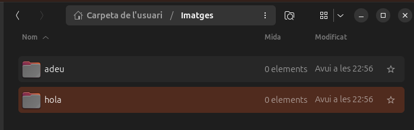
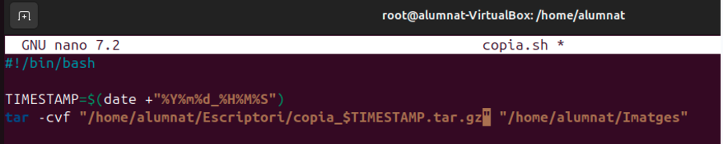
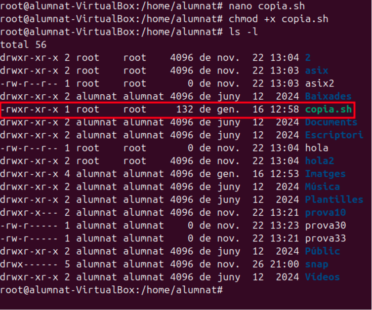
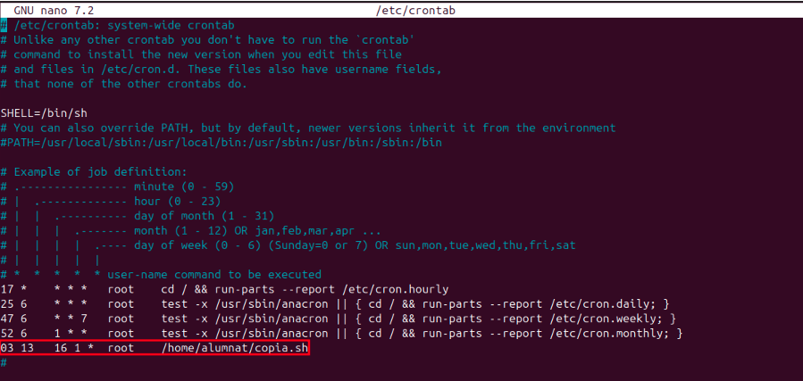
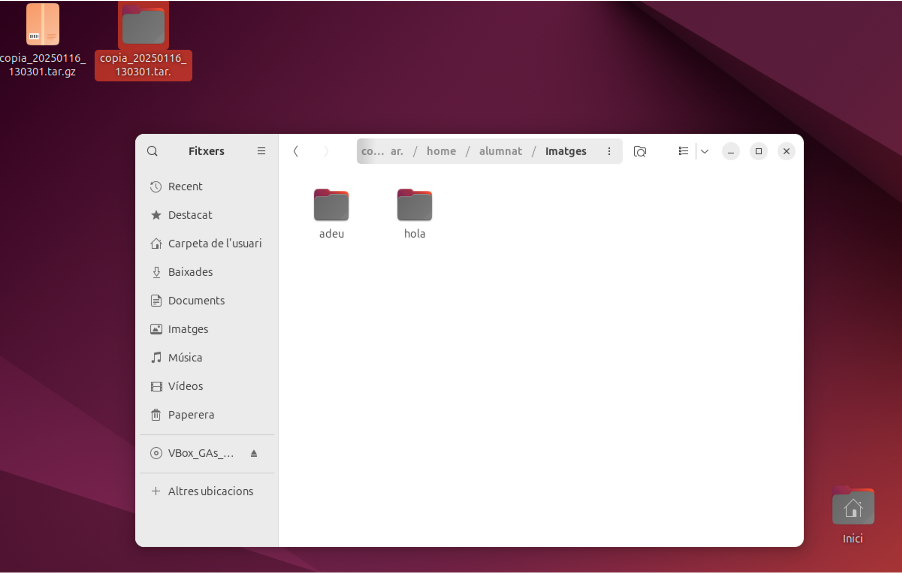
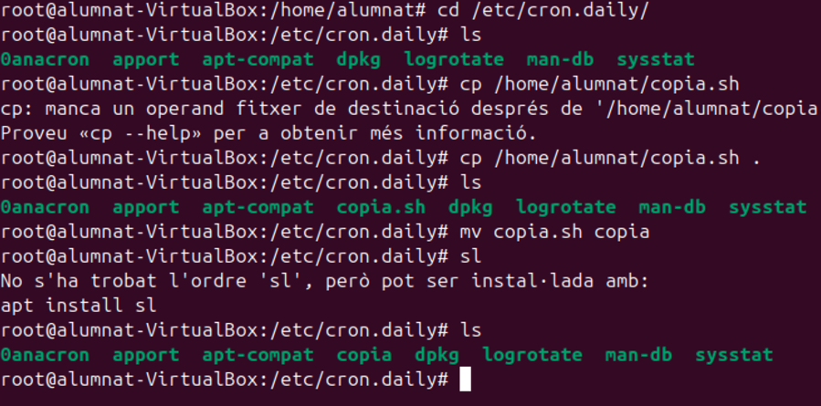
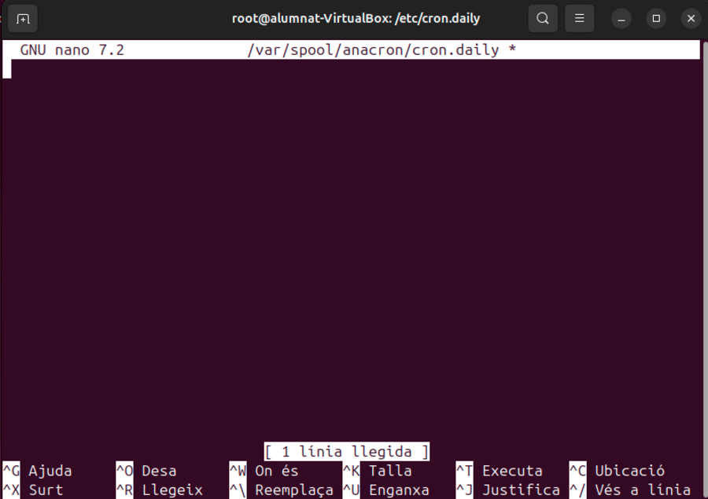
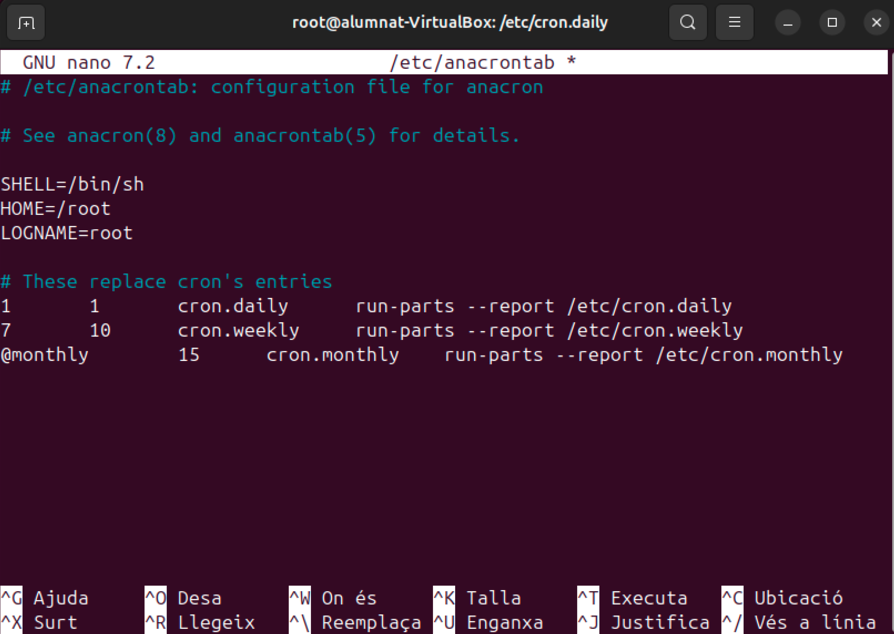
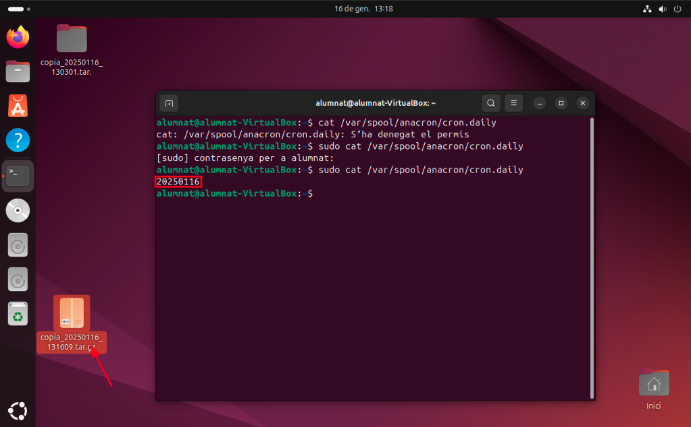

# Automatització amb Cron i Anacron

## Introducció

En aquest document, explorarem com automatitzar tasques utilitzant Cron i Anacron. Aquestes eines són essencials per a la gestió eficient del temps i la realització de tasques repetitives en sistemes Unix-like.

## Cron

Cron és un servei de planificació de tasques que permet executar scripts o comandes a intervals de temps específics.

### Exemple de Crontab

Per editar el crontab, utilitzeu la comanda `crontab -e`. Afegiu la següent línia per executar un script cada dia a les 2:30 AM:

```
30 2 * * * /path/to/script.sh
```

## Anacron

Anacron és una eina similar a Cron, però està dissenyada per a sistemes que no estan en funcionament constantment. Assegura que les tasques es completin fins i tot si el sistema està apagat durant el temps programat.

### Exemple de Configuració d'Anacron

Editeu el fitxer `/etc/anacrontab` per afegir una tasca que s'executi diàriament:

```
1   5   cron.daily   run-parts /etc/cron.daily
```

## Diferències entre Cron i Anacron

| Característica       | Cron                                      | Anacron                                    |
|----------------------|-------------------------------------------|--------------------------------------------|
| Disponibilitat       | Necessita que el sistema estigui en funcionament constantment | Pot executar tasques encara que el sistema hagi estat apagat |
| Interval de temps    | Pot programar tasques a intervals de temps específics (minuts, hores, dies, etc.) | Generalment utilitzat per a tasques diàries, setmanals o mensuals |
| Configuració         | Utilitza el fitxer `crontab` per a la configuració | Utilitza el fitxer `/etc/anacrontab` per a la configuració |
| Adequació            | Adequat per a servidors i sistemes que funcionen contínuament | Adequat per a ordinadors personals i portàtils que no estan sempre en funcionament |
| Execució de tasques  | Les tasques es perden si el sistema està apagat en el moment programat | Les tasques es recuperen i s'executen quan el sistema es torna a encendre |

## Quan utilitzar Cron o Anacron?

Cron i Anacron serveixen per a automatitzar tasques però tenen diverses diferències. Antigament treballaven per separat però ara treballen conjuntament. Quan utilitzem un o l’altre?

Utilitzarem el Cron quan els ordinadors estan oberts i l'Anacron quan sabem que poden estar tancats.

Normalment, quan volem que s’executi en un horari concret, utilitzarem el Cron, però quan estem parlant d’una execució d’una vegada al mes, o quan s’inicie sessió o una vegada a la setmana, utilitzarem l’Anacron.

Per a tasques generals i de manteniment del sistema operatiu, millor utilitzar Anacron. L’altre és millor per a tasques de cara a l'usuari.

Cron: Quan volem fer que s’executi alguna cosa globalment per a tots els usuaris del sistema, ho farem mitjançant el fitxer `/etc/crontab`. En canvi, quan volem alguna cosa molt particular per a un o dos usuaris, utilitzem la següent comanda:

```
crontab -e -u usuari
```

## Fitxers de configuració rellevants

- `/etc/anacrontab`
- `/var/spool/anacron/cron.daily`
- `/etc/cron.daily`
- `/etc/cron.hourly`

## Exemple cron

El primer que farem és crear dues carpetes dintre del directori d'imatges

{ width=70% }

Utilitzarem aquest scrit que ens permet fer una còpia de seguretat. Posem que la còpia es guardi a l'escriptori

{ width=70% }

Ara el que hemde fer és assignar permisos amb la comanda:
```
chmod +x copia.sh
```
{ width=70% }

Un cop hem donat permisos, ara anirem al arxiu crontab i l'editarem, afegint una nova línia fent que d'aqui 2 minuts executi copia.sh

{ width=70% }

- El 03 significa el minut
- El 13 l'hora
- El 16 el dia
- L'1 el mes

Això es pot anar configurant depenent de les necessitats que tinguis.

{ width=70% }

Finalment, podem comprovar que tot funciona correctament i que s'ha fet la còpia de seguretat a l'escriptori.

## Exemple anacron

Per començar, mourem l'escript al directori /etc/cron.daily/

{ width=70% }

Despres de mourel el que hem de fer es borrar el registre de anacron.daily per assegurar-nos de que funciona i comprovar-ho.

{ width=70% }

El que hem de fer és nomes borrar el contingut de l'arxiu.

{ width=70% }

Modifiquem el segon valor (temps en minuts) a 1  per fer que la tasca s'executi només un minut després d'iniciar el sistema.

{ width=70% }

Després de reiniciar la màquina, 1minut després ja podem veure un altre cop com ja apareix la còpia de seguretat al nostre escriptori.