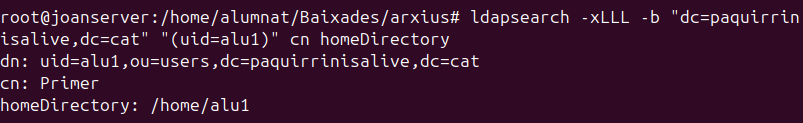

# Gestió del Servei LDAP

Aquest document serveix com a guia ràpida per gestionar el servidor LDAP amb operacions bàsiques com afegir, eliminar i modificar entrades.

---

## Afegir Entrades amb ldapadd

Per afegir una nova entrada a la base de dades LDAP s’utilitza la comanda `ldapadd` amb un fitxer LDIF que defineix l'entrada. Per exemple, crea el fitxer **user.ldif** amb el següent contingut:

```
dn: uid=eren,ou=usuaris,dc=paquirrinisalive,dc=cat
objectClass: inetOrgPerson
objectClass: posixAccount
objectClass: top
uid: eren
cn: Eren
sn: 123
givenName: Eren123
uidNumber: 1004
gidNumber: 1009
homeDirectory: /home/eren
loginShell: /bin/bash
userPassword: {SSHA}123
mail: eren@paquirrinisalive.cat
```

I executa la comanda:

```
ldapadd -x -D "cn=admin,dc=paquirrinisalive,dc=cat" -W -f user.ldif
```

---

## Consultes amb ldapsearch

El comandament `ldapsearch` és essencial per cercar informació i filtrar resultats. A continuació, alguns exemples:

### Filtrar Resultats

Per cercar un usuari específic amb un uid determinat:

```
ldapsearch -xLLL -b  "(uid=alu1)"
```

{ width=70% }


### Especificar Atributs

Per retornar només certs atributs, com `cn` i `homeDirectory`:

{ width=70% }

### Cerca amb Filtres Complexos

Per llistar totes les Unitats Organitzatives (UOs):

{ width=70% }

## Eliminació d'Entrades i Atributs

Hi ha dues maneres d’eliminar informació:

### Esborrar Atributs amb ldapmodify

Crea un fitxer LDIF per eliminar, per exemple, l'atribut `mail`:

{ width=70% }

```
dn: uid=alu1,ou=usuaris,dc=paquirrinisalive,dc=cat
changetype: modify
delete: mail
```

Aplica els canvis amb:

{ width=70% }

### Esborrar una Entrada amb ldapdelete

Per eliminar directament una entrada:

```
ldapdelete -x -D "cn=admin,dc=paquirrinisalive,dc=cat" -W "uid=alu1,ou=usuaris,dc=paquirrinisalive,dc=cat"
```

### Esborrar una Entrada amb ldapmodify

Alternativament, pots esborrar una entrada mitjançant un fitxer LDIF com aquest (ex. **esborrar_alu1.ldif**):

```
dn: uid=alu1,ou=usuaris,dc=paquirrinisalive,dc=cat
changetype: delete
```

I executar:

```
ldapmodify -x -D "cn=admin,dc=paquirrinisalive,dc=cat" -W -f esborrar_alu1.ldif
```

---

## Modificació d'Entrades amb ldapmodify

La comanda `ldapmodify` permet actualitzar atributs o reestructurar l’esquema d’entrades.

### Modificar un Únic Camp

Per actualitzar el número de telèfon i el correu, crea el fitxer **modificar_alu1.ldif**:

```
dn: uid=alu1,ou=usuaris,dc=paquirrinisalive,dc=cat
changetype: modify
replace: telephoneNumber
telephoneNumber: 123456789
-
replace: mail
mail: alu1@paquirrinisalive.cat
```

Executa la comanda:

```
ldapmodify -x -D "cn=admin,dc=paquirrinisalive,dc=cat" -W -f modificar_alu1.ldif
```

Verifica-ho amb:

```
ldapsearch -xLLL -b "uid=alu1,ou=usuaris,dc=paquirrinisalive,dc=cat" telephoneNumber mail
```

### Modificar Diversos Atributs i Moure una Entrada

Per actualitzar diversos camps i transferir l’usuari a una nova UO (per exemple, **asix**), crea el fitxer **modificar_alu1_complex.ldif**:

```
dn: uid=alu1,ou=usuaris,dc=paquirrinisalive,dc=cat
changetype: modify
replace: telephoneNumber
telephoneNumber: 611047095
-
add: mail
mail: alu1@paquirrinisalive,dc=cat
-
add: l
l: Barcelona
-
changetype: modrdn
newrdn: uid=alu1
deleteoldrdn: 1
newsuperior: ou=asix,dc=paquirrinisalive,dc=cat
```

Execució:

```
ldapmodify -x -D "cn=admin,dc=paquirrinisalive,dc=cat" -W -f modificar_alu1_complex.ldif
```

Verifica la nova ubicació:

```
ldapsearch -xLLL -b "uid=alu1,ou=asix,dc=paquirrinisalive,dc=cat"
```
