# Gestió de particions

## Creació d'una partició

Ara aprendrem a com crear una partició tant en format ext4 com en NTFS

El primer que farem és comprovar el nom de la nostra partició, en aquest cas, la meva es diu sdb, i té 10 GB d'emmagatzematge. I podem comprovar-ho mitjançant la comanda:

```
fdisk -l
```

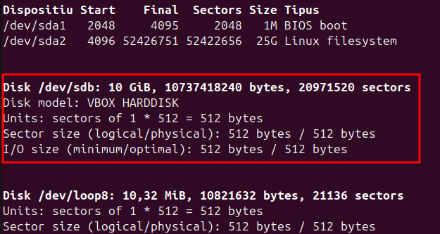{ width=70% }


Un cop ja tenim el nom del disc on volem crear la partició, ja podem començar amb la creació de la partició. Amb la comanda següent:

```
sudo fdisk /dev/sdb
```
Després d'executar la comanda, el que hem de fer és el següent:

- Escriure `n` per a crear una nova partició.
- Escriure `p` per a definir-la com una partició primària.
- Definir la mida de la partició, en aquest cas és a elecció pròpia, però jo he posat 20.000.000 bytes
- I molt important per a acabar i guardar hem d'escriure `w`


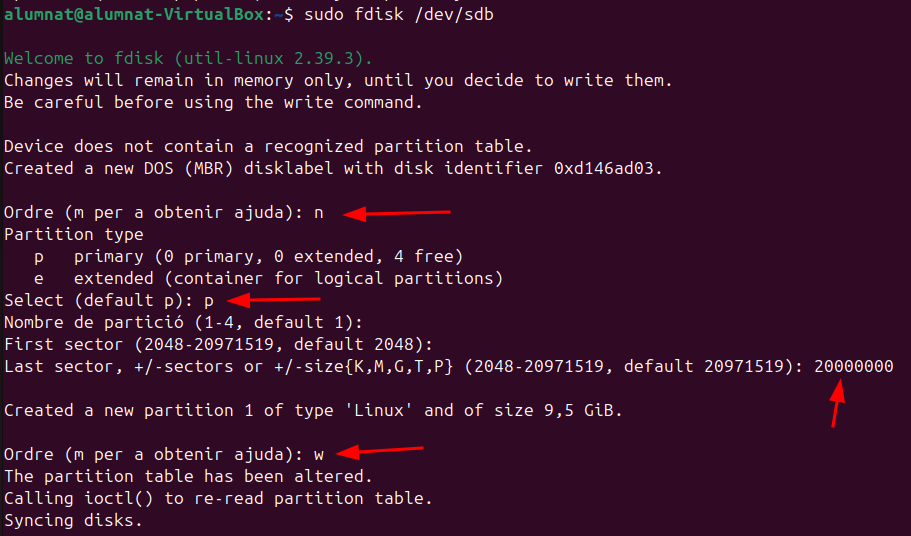{ width=70% }

## Particions EXT4

Un cop hem fet la partició, podrem formatar la partició en ext4 amb la següent comanda:

```
sudo mkfs.ext4 -b 2048 /dev/sdb1
```
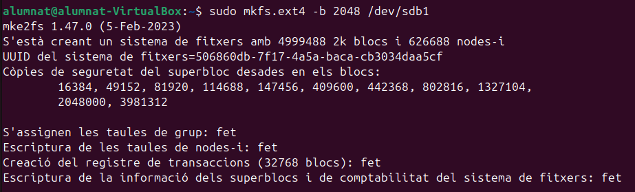{ width=70% }

**Mida del bloc**

Amb la següent comanda podem fer la comprovació de la mida del bloc que hem donat a la particio.
```
sudo tune2fs -l /dev/sdb1 | grep Block
```
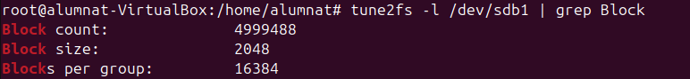{ width=70% }

Block count indica el nombre total de blocs que te cada partició. Block size indica la mida de cada bloc que està assignada. I blocks per group idica el nombre de blocs per cada gruo assignats. 

## Particions NTFS

Per continuar amb les particions NTFS el que hem de fer es crear una segona partició, si voleu en el mateix disc. En el meu cas aquesta segona partició s'anomena sdb2 i el que farem per convertir-la a NTFS és executar la següent comanda: 

```
mkfs.ntfs -Q /dev/sdb2
```

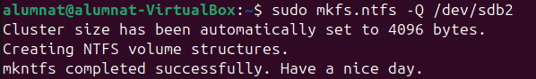{ width=70% }


Després d'això el que farem es verificar que tot s'hagi creat amb el format correcte amb la comanda:

```
lsblk -f
```
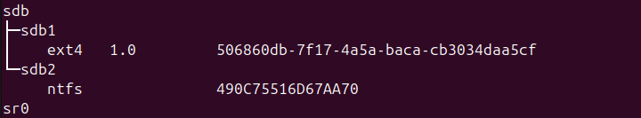{ width=70% }

## Carpeta a la partició temporal

Ara crearem una carpeta i un arxiu dins d'aquesta. 

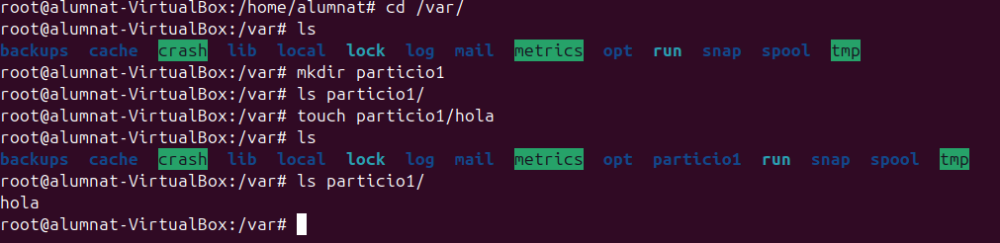{ width=70% }

Un cop tenim la carpeta i l'arxiu creat, muntarem la carpeta dintre de /dev/sdb1. Això no serà visible per a l'usuari, pero ens assegura que en el cas de que es trenqui el disco o passi alguna cosa amb aquest, no es perdi tota la informació emmagatzemada. Per a muntar la carpeta a /deb/sdb1 ho farem amb aquesta comanda:

```
sudo mount -t ext4 /dev/sdb1 /var/particio1/
```
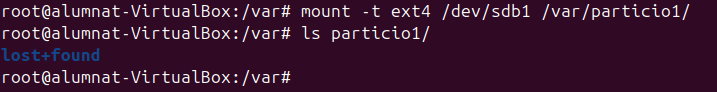{ width=70% }

Els arxius es guarden a la particio que hem muntat pero els que ja estaven previament no s'esborren. Queden ocults. 

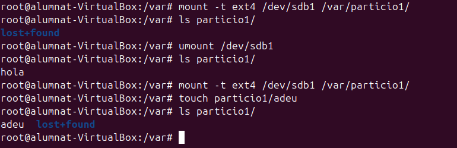{ width=70% }

- **ls particio1/**: Llistem el contingut del directori `particio1/`. Inicialment, només apareix el directori `lost+found`, que es crea automàticament en particions formatades amb ext4.

- **touch particio1/adeu**: Creem un fitxer buit anomenat `bye` dins de la carpeta muntada `particio1/`.

- **umount /dev/sdb1**: Desmuntem la partició `/dev/sdb1`, fent que el contingut de la partició deixi d'estar accessible.

- **ls particio1/**: Tornem a llistar el contingut de la carpeta. Ara no apareix el fitxer `adeu`, ja que aquest estava dins de la partició muntada i aquesta ja no està accessible.

- **ls partition1/ després de desmuntar**: Aquí es mostren només els fitxers que pertanyen al directori local, fora del sistema de fitxers muntat. Quan es desmunta, el contingut de la partició queda separat del directori. Això demostra com el muntatge i desmuntatge funcionen per accedir al contingut de particions.

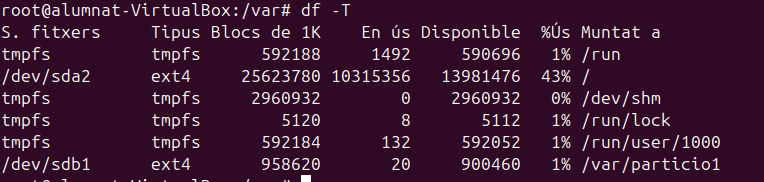{ width=70% }

Per comprovar que la partició existeix utilitzem la comanda:

```
df -T
```

Aquesta comanda mostra una llista de totes les particions muntades juntament amb el tipus de sistema de fitxers de cadascuna. I com podem veure, aquí segueix present.
Però despres de reiniciar la màquina, si tornem a utilitzar la mateixa comanda, podem veure com l a partició sdb1 ja no apareix

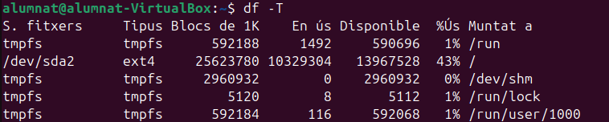{ width=70% }


Per a fer un muntatge permanent, és necessari editar el fitxer /etc/fstab, afegint els paràmetres necessaris

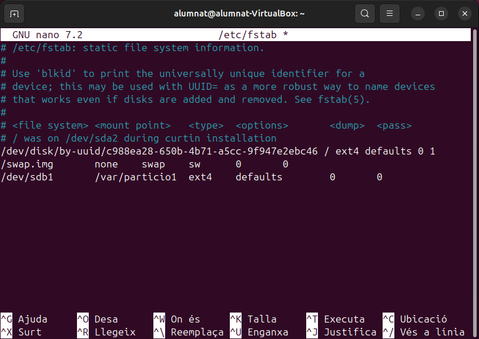{ width=70% }

Després de reiniciar el sistema, si hem posat els paràmetres correctament la màquina funcionarà corrrectament. I tornem a fer `df -T`. Podem observar que sdb1 ja torna a aparèixer, i podem fer un ls de particio1.

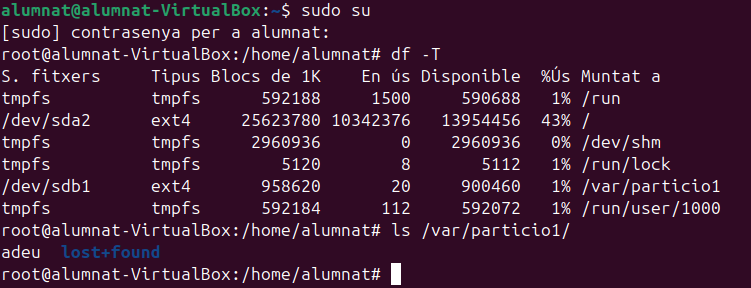{ width=70% }

## Compartir fitxers en xarxa

Per a compartir fitxers en xarxa utilitzarem una eina anomenada samba.

Samba és una eina que permet compartir fitxers i impressores entre ordinadors amb Linux i Windows. Per configurar Samba, instal·la el paquet, edita el fitxer `/etc/samba/smb.conf` i defineix els recursos a compartir i els permisos d'accés.

El primer que farem és instal·lar samba

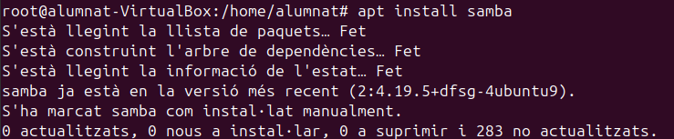{ width=70% }

Un cop hem instal·lat samba, donem els permisos 777 a la carpeta particio1, és a dir que tothom pot fer el que vulgui amb ella.

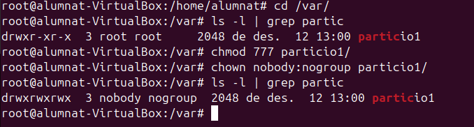{ width=70% }

I després d'això, ja podem editar l'arxiu smb.conf


```
sudo nano /etc/samba/smb.conf
```

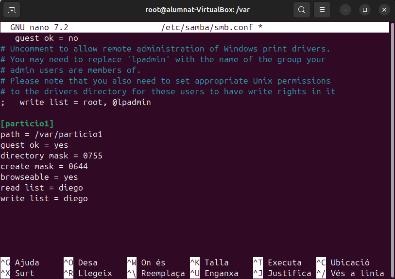{ width=70% }

Ara reiniciem el servei de samba i intentem connectar-nos

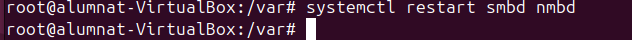{ width=70% }

En connectem obrint "Other locations" enlasecció de fitxers, i introduint la nostra ip. (Si esteu en una màquina la IP de la màquina).
Ens demanarà unes credecials, són les que hem posar anteriorment editant el fitxer de smb.conf i ja podrem accedir a la carpetacompartida.

{ width=70% }


