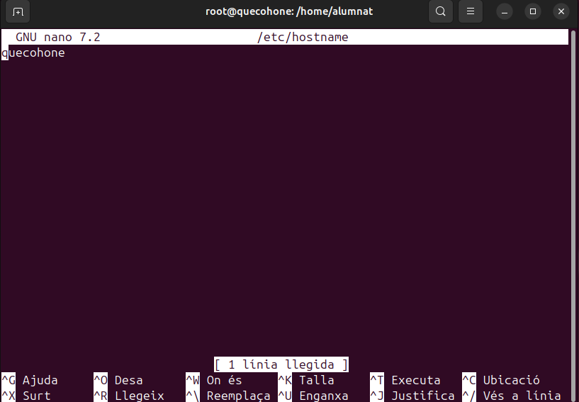
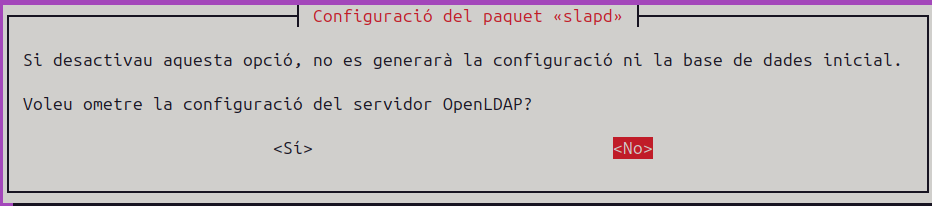
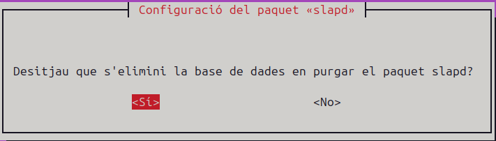
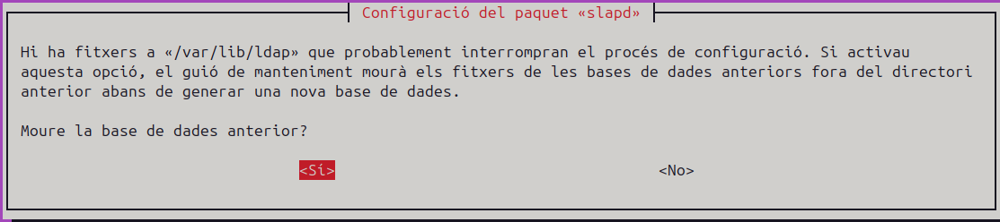
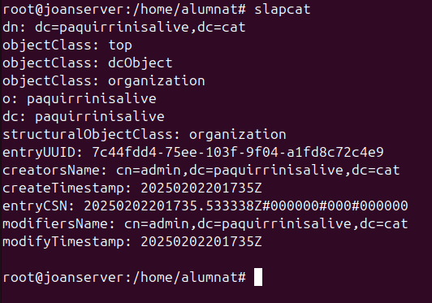
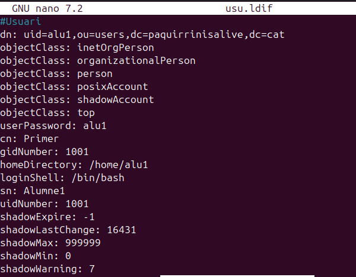
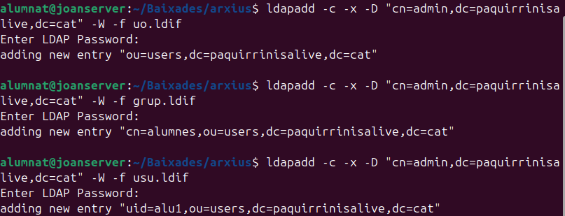

# Instal·lació LDAP

## Què és LDAP?

LDAP (Lightweight Directory Access Protocol) és un protocol que permet accedir i gestionar serveis d'informació de directori distribuïts en una xarxa IP. És útil per organitzar i administrar informació com usuaris, grups, dispositius i altres recursos dins d'una xarxa.

## Què és un domini?

Un domini és una unitat administrativa dins d'una xarxa que organitza i gestiona recursos com usuaris, grups, dispositius i altres objectes. Els dominis permeten aplicar polítiques de seguretat, gestionar permisos i autenticar usuaris de manera centralitzada. En un entorn LDAP, un domini es defineix per un nom de domini complet (FQDN) i pot contenir múltiples unitats organitzatives (OUs) que ajuden a estructurar i segmentar els recursos de manera lògica.

## Usos de LDAP

LDAP s'utilitza en diverses situacions, incloent:

- **Autenticació d'usuaris**: LDAP permet centralitzar l'autenticació dels usuaris en una xarxa, facilitant la gestió de credencials.
- **Gestió de recursos**: Permet administrar dispositius, aplicacions i altres recursos de manera centralitzada.
- **Directori d'empresa**: Utilitzat per mantenir un directori d'empleats, incloent informació de contacte i posicions.
- **Control d'accés**: Facilita la implementació de polítiques de seguretat i control d'accés a diferents recursos de la xarxa.
- **Integració amb altres serveis**: LDAP es pot integrar amb altres serveis com correu electrònic, VPNs, i aplicacions empresarials per proporcionar una gestió unificada.

En aquest cas, utilitzarem `slapcat`, que serveix per exportar el contingut d'una base de dades LDAP a un fitxer en format LDIF (LDAP Data Interchange Format). Aquest format és un estàndard per representar dades LDAP en text pla, el que facilita la seva lectura i manipulació.

## Què són els fitxers LDIF?

Els fitxers LDIF (LDAP Data Interchange Format) són fitxers de text pla utilitzats per representar dades d'un directori LDAP. Aquests fitxers permeten exportar i importar informació de manera estàndard, facilitant la transferència de dades entre diferents sistemes LDAP. Un fitxer LDIF conté una sèrie d'entrades, cadascuna de les quals representa un objecte del directori, com ara usuaris, grups o dispositius. Cada entrada inclou una sèrie d'atributs i els seus valors corresponents.

## Creació d'un domini amb LDAP

### Establir una IP estàtica

El primer que farem és establir una IP estàtica al sistema per evitar possibles errors en el futur. Si la IP canvia, hauríem de modificar els fitxers de configuració. En aquest cas, la meva IP és 10.0.2.14, però podeu utilitzar qualsevol altra que us convingui.

{ width=70% }

### Canviar el hostname

Per canviar el nom de la màquina, podem utilitzar la següent comanda:

```bash
sudo nano /etc/hostname
```

{ width=70% }

Afegirem el nom i la IP al fitxer `/etc/hosts` perquè el sistema pugui reconèixer el nom del servidor i el domini:

```bash
sudo nano /etc/hosts
```

{ width=70% }

### Instal·lacions necessàries LDAP

Ara que tenim la configuració inicial finalitzada, començarem amb la instal·lació de paquets essencials per treballar amb LDAP:

```bash
sudo apt install slapd ldap-utils
```

{ width=70% }

### Verificació inicial LDAP

Després d'executar la comanda `slapcat`, es pot veure que el directori no està completament buit. Conté una configuració mínima inicial amb el domini `dc=nodomain`. Això indica que el servidor LDAP està funcionant, però encara no s'ha configurat adequadament.

{ width=70% }

## Configuració LDAP

Per configurar el servidor LDAP, utilitzarem:

```bash
sudo dpkg-reconfigure slapd
```

Seguirem els següents passos:

1. Seleccionem "No" per continuar amb la configuració
{ width=70% }

2. Assignem un nom al domini
{ width=70% }

3. Introduïm el nom de l'organització
{ width=70% }

4. Assignem una contrasenya d'administrador
{ width=70% }

5. Eliminem la base de dades anterior
{ width=70% }

6. Movem la base de dades antiga
{ width=70% }

Un cop finalitzada la configuració, podem verificar que tot s'ha creat correctament:

{ width=70% }

Comprovem la configuració amb `slapcat`:

{ width=70% }

## Fitxers LDIF

Els fitxers LDIF són essencials per definir i importar dades en un servidor LDAP. Per exemple, per crear una Unitat Organitzativa (OU) anomenada "users", creem un fitxer `uo.ldif` amb els següents elements:

- **dn (Distinguished Name)**: Especifica la ubicació única de l'objecte
- **objectClass**: Defineix el tipus d'objecte
- **ou**: Indica el nom de la unitat organitzativa

{ width=70% }

Creació del fitxer grup.ldif

El fitxer grup.ldif defineix un grup dins del nostre servidor LDAP. Aquest grup serà associat a una Unitat Organitzativa (OU) ja existent (en aquest cas, users). Aquí detallem els paràmetres utilitzats:

alt text

dn (Distinguished Name): Identifica de manera única el grup (cn=alumnes,ou=users,dc=vitaliy,dc=com).
objectClass: Defineix el tipus d'objecte (en aquest cas, posixGroup, per a grups POSIX).
cn: Nom del grup (alumnes).
gidNumber: Identificador únic del grup (1001).
memberUid: Usuaris membres del grup (en aquest cas, alu1).
Aquest fitxer es pot importar al servidor LDAP per crear i gestionar grups d’usuaris, facilitant l’organització i la configuració d’accés.

{ width=70% }

### Creació del fitxer usu.ldif

El fitxer `usu.ldif` s'utilitza per crear i configurar usuaris dins del servidor LDAP. Aquest fitxer conté els paràmetres bàsics necessaris per definir un compte d'usuari, però es pot ampliar amb informació addicional com correu electrònic, número de telèfon, etc.

- **dn (Distinguished Name)**: Identifica de manera única l'usuari dins del directori
- **objectClass**: Defineix les classes associades a l'usuari:
  - inetOrgPerson i organizationalPerson per a dades personals i organitzatives
  - posixAccount i shadowAccount per a compatibilitat amb sistemes POSIX i gestió de contrasenyes
- **userPassword**: Contrasenya de l'usuari (en format encriptat és recomanable)
- **cn**: Nom complet de l'usuari (exemple: Primer)
- **sn**: Cognom de l'usuari (exemple: Alumne1)
- **gidNumber**: Identificador del grup al qual pertany l'usuari (exemple: 1001)
- **uidNumber**: Identificador únic de l'usuari (exemple: 1001)
- **homeDirectory**: Directori personal de l'usuari (exemple: /home/alu1)
- **loginShell**: Shell predeterminada de l'usuari (exemple: /bin/bash)
- **shadowExpire, shadowLastChange, shadowMax, shadowMin, shadowWarning**: Paràmetres relacionats amb la caducitat i gestió de contrasenyes
Aquest fitxer es pot utilitzar per afegir l'usuari al directori LDAP mitjançant comandes com ldapadd. A més, es poden incloure atributs addicionals, com correu electrònic o telèfon, segons les necessitats de l'organització.


{ width=70% }
### Carregar fitxers .ldif al servidor LDAP

Un cop creats els fitxers .ldif, el següent pas és carregar-los al servidor LDAP. Aquest procés permet crear els objectes definits (unitats organitzatives, grups i usuaris) dins del directori.

Per fer-ho, utilitzarem la comanda `ldapadd`:

```bash
ldapadd -c -x -D "cn=admin,dc=paquirrinisalive,dc=cat" -W -f <nom_fitxer>
```

Els paràmetres utilitzats són:

- `-c`: Continua processant malgrat errors
- `-x`: Utilitza autenticació simple
- `-D`: Especifica el DN de l'administrador
- `-W`: Sol·licita la contrasenya interactivament
- `-f`: Indica el fitxer .ldif a carregar

Aquesta comanda s'ha d'executar per cada fitxer .ldif que vulguem carregar (uo.ldif, grup.ldif, usu.ldif).

{ width=70% }

Per acabar, fem una comprovació final

{ width=70% }
