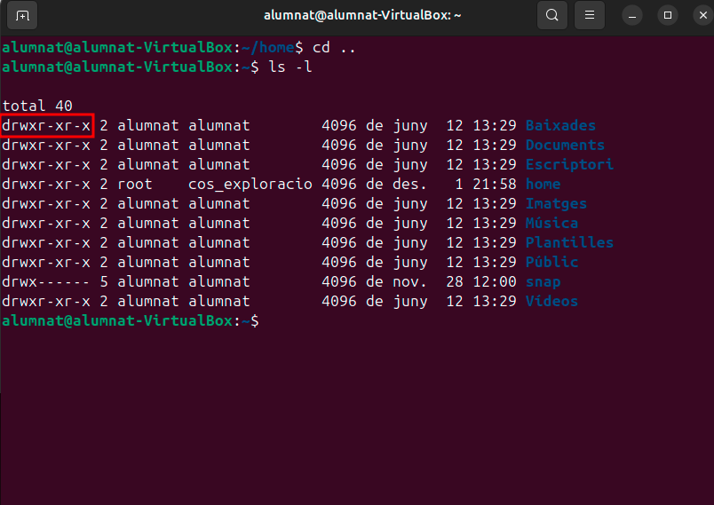

# Permisos en linux

Els permisos en Linux controlen qui pot llegir, executar o escriure fitxers o directoris:

- **r**: Permet llegir
- **w**: Permet escriure
- **x**: Permet executar

Aquí tenim una imatge de exemple per a comprovar com funciona

Podem veure que hi han 10 caràcters per als permisos, cada 3 caràcters és per a un usuari diferent:

Els tres primers caràcters (obviant la d, que vol dir que és un directori) són per a el propietari del fitxer. Com podem comprovar té tots els permisos (rwx)

Els altres tres son per al grup associat al fitxer. Com podem comprovar pot llegir i executar (-xr)

I els tres últims son per a els altres usuaris. Només por executar (-x)

## **Modificar permisos**
Amb la comanda `chmod` podem modificar els permisos dels fitxers i directoris. Aquí hi ha alguns exemples de comandes `chmod`:

- `chmod 755 fitxer`: Assigna permisos de lectura, escriptura i execució per al propietari, i permisos de lectura i execució per al grup i altres usuaris.
- `chmod 644 fitxer`: Assigna permisos de lectura i escriptura per al propietari, i només permisos de lectura per al grup i altres usuaris.
- `chmod +x fitxer`: Afegeix el permís d'execució per a tots els usuaris.
- `chmod -r fitxer`: Treu el permís de lectura per a tots els usuaris.
- `chmod u+w fitxer`: Afegeix el permís d'escriptura només per al propietari.
- `chmod g-r fitxer`: Treu el permís de lectura només per al grup.
- `chmod o+x fitxer`: Afegeix el permís d'execució només per als altres usuaris.

Aquestes comandes ens permeten controlar qui pot accedir i modificar els nostres fitxers i directoris.

## **Taula permisos**

| Número | Permisos | Descripció |
|--------|----------|------------|
| 0      | ---      | Sense permisos |
| 1      | --x      | Només executar |
| 2      | -w-      | Només escriure |
| 3      | -wx      | Escriure i executar |
| 4      | r--      | Només llegir |
| 5      | r-x      | Llegir i executar |
| 6      | rw-      | Llegir i escriure |
| 7      | rwx      | Llegir, escriure i executar |

## **Sticky bit**

El **sticky bit** és un permís especial que es pot assignar a un directori. Quan el sticky bit està activat en un directori, només el propietari del fitxer, el propietari del directori o l'usuari root poden esborrar o canviar el nom dels fitxers dins d'aquest directori. Això és útil en directoris compartits on molts usuaris poden crear fitxers, però no es vol que puguin esborrar o modificar els fitxers d'altres usuaris.

Per activar el sticky bit en un directori, es pot utilitzar la comanda `chmod` amb el valor `+t`. Aquí hi ha un exemple:

- `chmod +t directori`: Activa el sticky bit en el directori especificat.

Per desactivar el sticky bit, es pot utilitzar la comanda `chmod` amb el valor `-t`:

- `chmod -t directori`: Desactiva el sticky bit en el directori especificat.

Quan el sticky bit està activat, els permisos del directori es mostren amb una `t` al final dels permisos per als altres usuaris. Per exemple:

- `drwxrwxrwt`: Indica que el directori té el sticky bit activat.