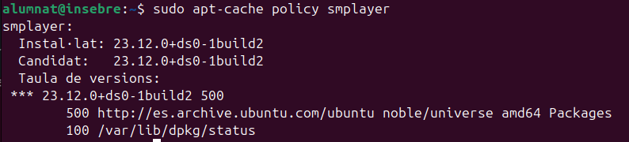
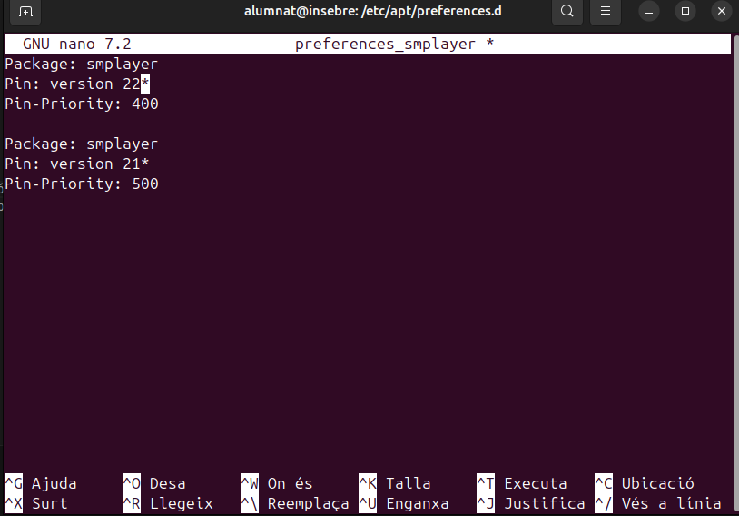

# Pinning packet

El pinning packet consisteix en establir una versió per a instal·lar-la en comptes de fer una instal·lació de la última versió del programa. 

El que he fet ha estat instal·lar el programa smplayer, per a provar la funcionalitat del pinning packet. Després d'instal·lar-lo amb un 

```
sudo apt install smplayer
```

El que hem de fer es comprovar la versió, i la versió prioritzada amb la comanda 

```
sudo apt-cache policy smplayer
```



Com podem comprovar s'ha instal·lat la versió predefinida que és la "Candidat". Després de comprovar això, el que hem de fer és crear un arxiu amb el nom que vulguis, jo l'he posat preferences_smplayer.txt, a l'ubicació "/etc/apt/preferences.d/". És a dir, primer haurem de fer aquesta comanda per anar a la ubicació nomenada anteriorment.

```
cd /etc/apt/preferences.d/
```

Després de fer un cd, el que hem de fer és generar un document .txt, ho podem fer amb la següent comanda:

```
sudo touch nom_arxiu
```
Un cop creat l'arxiu, l'hem de editar. 

```
sudo nano nom_arxiu
```

Un cop fet el nano, podrem editar l'arxiu.



En aquesta imatge el que diu es que el paquet "smplayer" amb la versió 22 o superior té una prioritat de 400, mentre que la versió 21 de smplayer té una prioritat de 500. És a dir que ara en fer la comanda "sudo apt-cache policy smplayer" hauria de sortir com a versió candidat la 23

