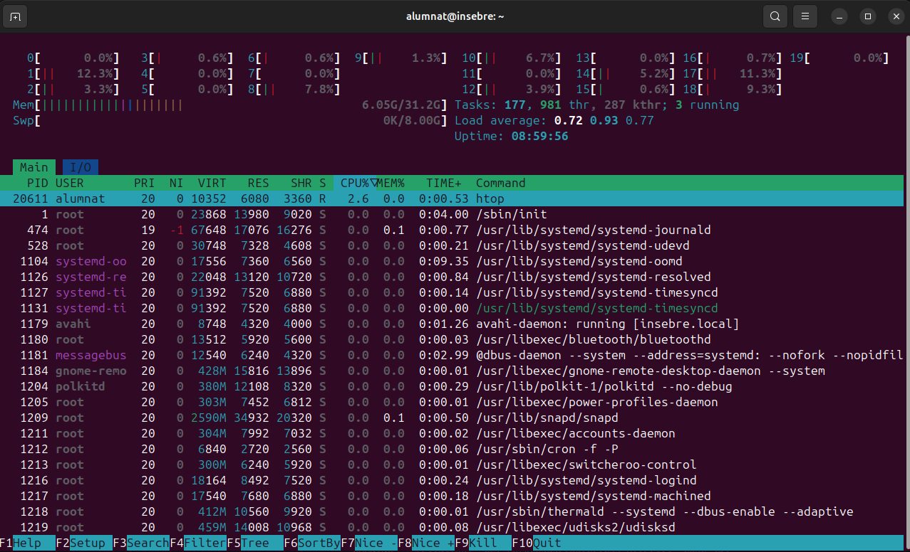

# Gestió de procesos

## **Què és un procés?**

Un procés és un programa en execució que inclou:

- Codi del programa.
- Recursos assignats (memòria, fitxers oberts, etc.).
- Execució en un o més fils (threads).

Tipus de processos:

- En primer pla: Interactuen amb l'usuari a la terminal.
- En segon pla: Funcionen sense interferir directament amb l'usuari.

## **Comanda `top`**

Mostra en temps real els processos actius.

Informació mostrada:

- **PID**: Identificador del procés.
- **USER**: Usuari que va iniciar el procés.
- **%CPU**: Percentatge d'ús del processador.
- **%MEM**: Percentatge d'ús de la memòria RAM.
- **COMMAND**: Nom del procés.

{ width=60% }


`Si premem la tecla k i introduim el nombre de proces que volem apagar, aquest procés s'apagarà.`

## **htop**

Htop es bàsicament el mateix que top, però més user friendly per a les persones que no estan gaire acostumbrades. És més cómode i és mes agradable visualment

Per instal·lar-lo utilitzarem la següent comanda:

```
sudo apt install htop
```

{ width=60% }

## **Senyals de processos**
Els senyals permeten interactuar amb els processos, com tancar-los, pausar-los o reprendre'ls. Alguns senyals comuns:

- SIGTERM (15): Sol·licita que el procés acabi de manera ordenada.
- SIGKILL (9): Força la terminació immediata del procés.
- SIGSTOP (19): Pausa el procés sense matar-lo.
- SIGCONT (18): Reprèn un procés pausat.


## **Matar i gestionar processos**
- La comanda `kill`: Permet enviar senyals als processos per finalitzar-los o gestionar el seu estat.
    - kill <PID>: Envia un senyal de terminació.
    - kill -9 <PID>: Força la terminació immediata (SIGKILL).
- Comanda `pkill`: Permet matar processos per nom.
- Comanda `killall`: Mata tots els processos amb un mateix nom.

## **Gestió de processos amb Ctrl+C i Ctrl+Z**
- Ctrl+C: Finalitza immediatament el procés en primer pla.
- Ctrl+Z: Pausa el procés en primer pla i el mou al segon pla (estat "Aturat").

## **Processos zombies**
Un procés zombi és un procés que ha finalitzat però encara ocupa una entrada a la taula de processos perquè el seu procés pare no ha recollit el seu codi de sortida.

Identificar-los: Utilitza ps aux | grep Z per veure els processos zombies.
Matar-los: Utilitza kill <PID> o kill -9 <PID> per eliminar-los.


