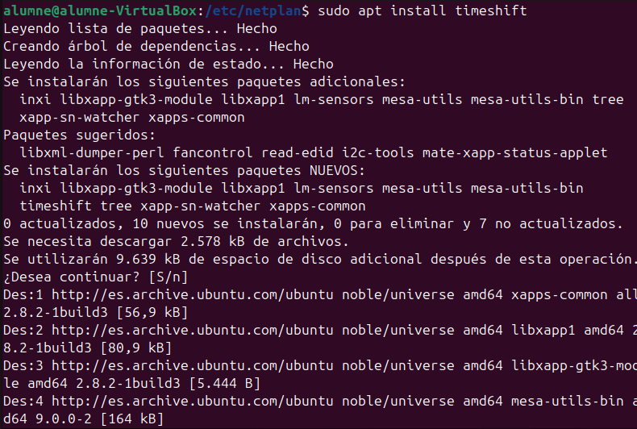
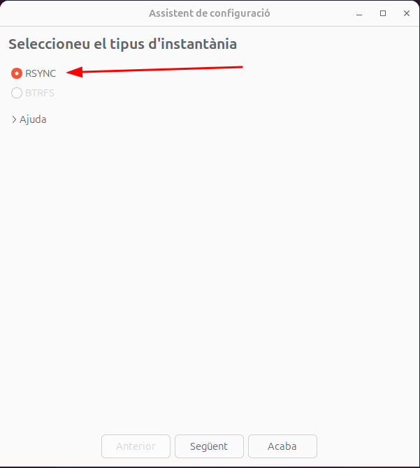
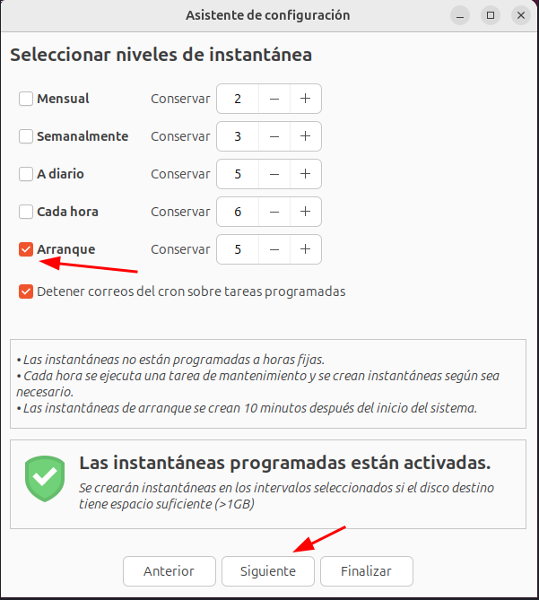
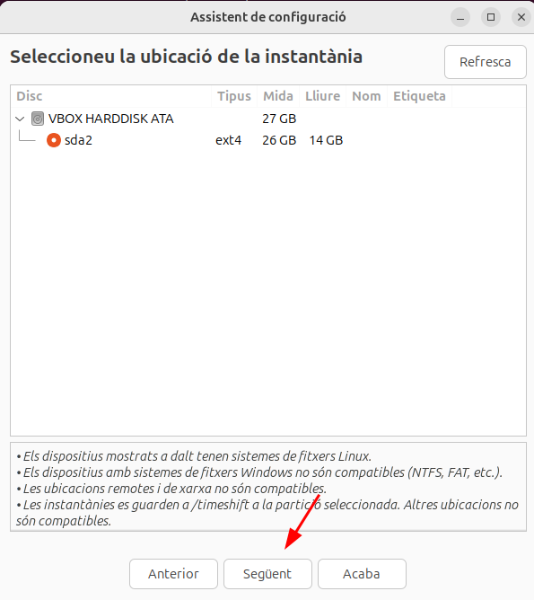
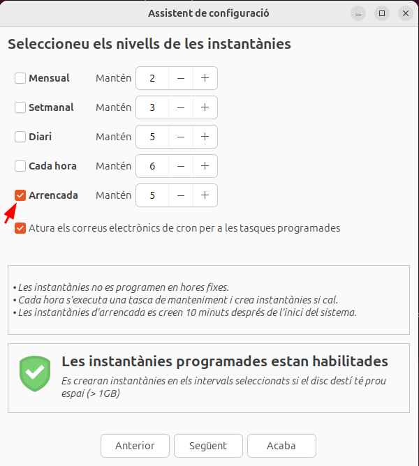
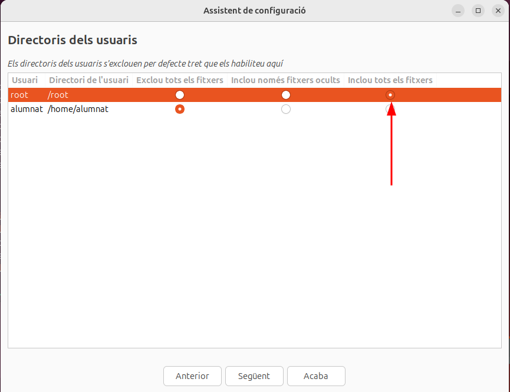
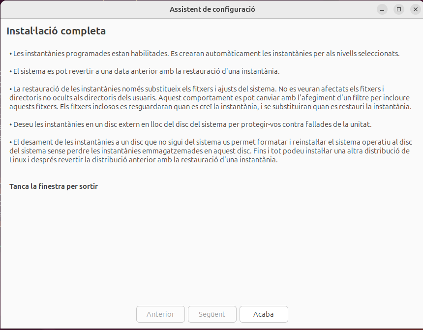
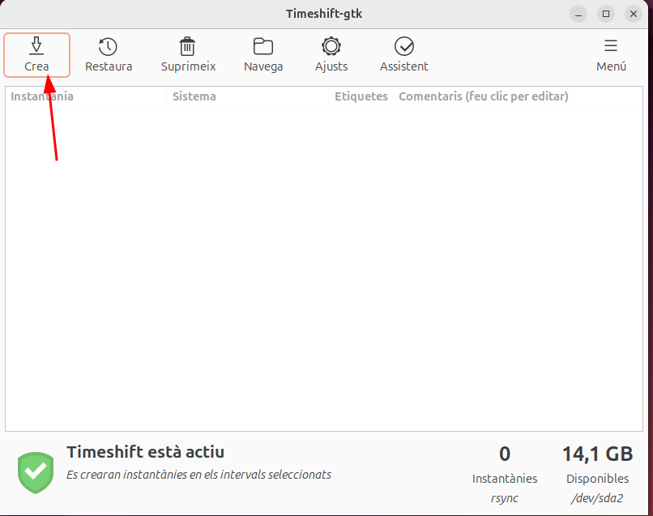
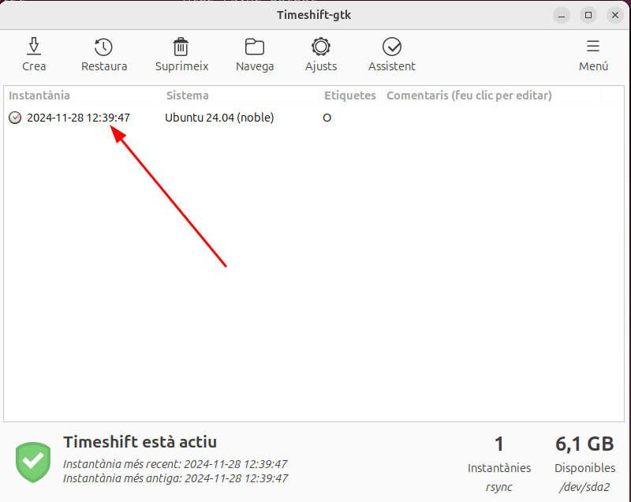

# Instal·lació del timeshift

## Què és el timeshift?

El timeshift és un programa que et permet fer còpies de seguretat dintre del teu dispositiu. Bàsicament, fa una instantània del sistema guardant arxius i configuracions. 

## Procés

Aquí farem una instal·lació del programa timeshift i farem una còpia de seguretat amb aquest programa. Primerament, farem l'instal·lació del programa amb la següent comanda

```
sudo apt install timeshift
```



Un cop tenim el timeshift, el que hem de fer és obrir el programa, i ens sortirà el següent menú, seleccionem l'opció marcada amb la fletxa




Aquí seleccionem que faci una instantanea cada vegada que s'arranqui el sistema. 



Aquí nomes hem de clicar següent, en aquesta part ens pregunta on volem la instantània



Ara, en aquest apartat podem seleccionar cada quan volem que es faci una instantània, el que recomano jo és que en faci una cada arrencada.



Aqui seleccionem que faci una instantània de "root"



Un cop cliquem següent, s'hauria finalitzat la configuració de la instal·lació de la imatge.



Ara un cop finalitzat ja podem crear una instantània per comprovar si funciona. 



I ja estaria, ara tenim la imatge del ordenador guardada al timeshift



