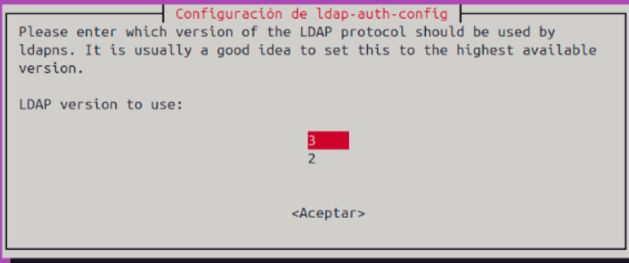
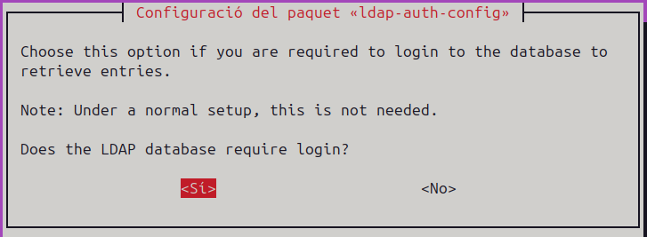

# Integrar un client amb LDAP

Aquest document descriu els passos per afegir un client a un domini LDAP de manera senzilla i eficient.

## Requisits previs

Abans d'iniciar el procés d'integració, és recomanable actualitzar el sistema per assegurar que disposeu dels paquets més recents:

```bash
sudo apt update
```

## Instal·lació dels paquets essencials

Instal·leu els paquets que permetran la comunicació amb LDAP:

```bash
sudo apt install libnss-ldap libpam-ldap nscd
```

Durant la instal·lació, se us sol·licitarà que introduïu els paràmetres de configuració per connectar-vos al servidor LDAP. En cas que la finestra de configuració es tanqui per error, podeu tornar-la a obrir amb:

```bash
sudo dpkg-reconfigure ldap-auth-config
```

## Configuració del client LDAP

1. Introduïu l'adreça del servidor amb el format correcte:
    ```
    ldap://adreça-del-servidor
    ```
    Eviteu utilitzar el format ldapi:///.

{ width=70% }


2. Especifica el DN (nom distingit) base per la recerca, habitualment derivat del domini de l'organització.

{ width=70% }

3. Seleccioneu la versió 3 del protocol LDAP per assegurar compatibilitat.

{ width=70% }


4. Perquè l'usuari root local mantingui privilegis d'administració sobre LDAP, confirmeu aquesta opció durant la configuració.

{ width=70% }

5. Activeu l'autenticació segura per a LDAP. Utilitzeu un compte d'administració (com "admin") amb la contrasenya corresponent. També podeu configurar un usuari sense permisos administratius per a la base de dades, encara que es recomana utilitzar un nom descriptiu.

{ width=70% }

{ width=70% }

{ width=70% }

6. Mantingueu el mètode de hash de les contrasenyes com a MD5 per emmagatzemar-les de forma segura.

{ width=70% }


## Configuració addicional

### Actualització del fitxer nsswitch.conf

Afegiu les línies pertinents al fitxer de configuració nsswitch.conf per redirigir l'autenticació cap a LDAP en lloc de la informació local.

{ width=70% }

### Configuració de la sessió

Per a la creació automàtica dels directoris personals dels usuaris LDAP, editeu el fitxer `/etc/pam.d/common-session`:

```bash
sudo nano /etc/pam.d/common-session
```

Al final del fitxer, afegiu:

```
session optional pam_mkhomedir.so skel=/etc/skel umask=022
```

Això assegura que cada usuari que inicia sessió rebi el seu directori personal amb la configuració correcta.

{ width=70% }

### Configuració de la pantalla d'inici (greeter)

Per permetre l'inici de sessió manual, afegiu la següent línia al fitxer de configuració del greeter:

```
greeter-show-manual-login=true
```
{ width=70% }

## Verificació de la Configuració LDAP

1. Per comprovar que el sistema consulta correctament el servidor LDAP, executeu:

    ```bash
    sudo getent passwd
    ```

    Si un usuari definit en LDAP (com per exemple, alu1) apareix, la configuració és correcta.

2. Reiniar el sistema per aplicar tots els canvis.

3. Inicieu sessió amb un usuari LDAP (per exemple, alu1) i verifiqueu l'autenticació amb:

    ```bash
    whoami
    ```

Si es mostra el nom d'usuari, la integració amb LDAP s'ha completat amb èxit.

