# Gestió d'usuaris

Aquí aprendrem a gestionar els usuaris dintre d'un sistema linux, això ajuda molt en espais on hi han diferents usuaris que poden tenir diferents permisos. Per exemple, en un institut, podriem tenir l'usuari profressor o l'usuari alumne, cadascun amb uns permisos diferents. 

En aquesta part de la pàgina aprendrem a fer això

## **Afegir i eliminar usuaris**

### **Afegir usuari amb adduser**

Per començar, afegirem un usuari nou amb una simple comanda. I on pregunta alguns camps, si els volem posar per defecte, simplement cliquem a al atecla enter.

```
sudo adduser nom_usuari
```

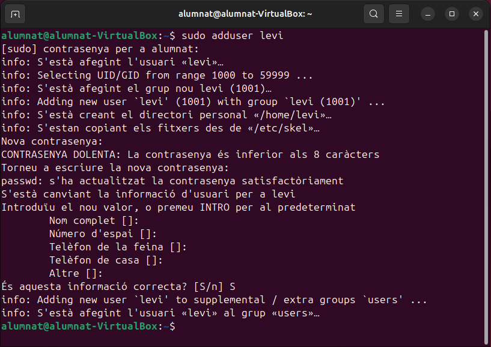{ width=50% }


Ara per comprovar que tot funciona correctament, iniciem l'usuari nou, en el meu cas l'usuari es diu "levi". Podem veure que a l'hora de seleccionar un usuari a parte del usuari predeterminat que teniem abans, ens surt l'usuari creat anteriorment.

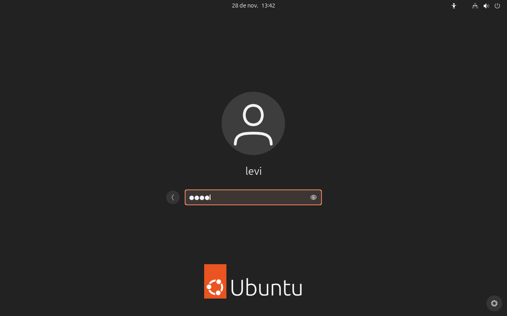{ width=50% }

Per comprovar que realment tenim l'usuari seleccionat també podem utilitzar la comanda whoami.

### **Afegir usuari sense carpeta personal**

Per a crear un usuari sense carpeta persona dintre del sistema podem utilitzar una comanda diferent:

```
sudo useradd eren
```

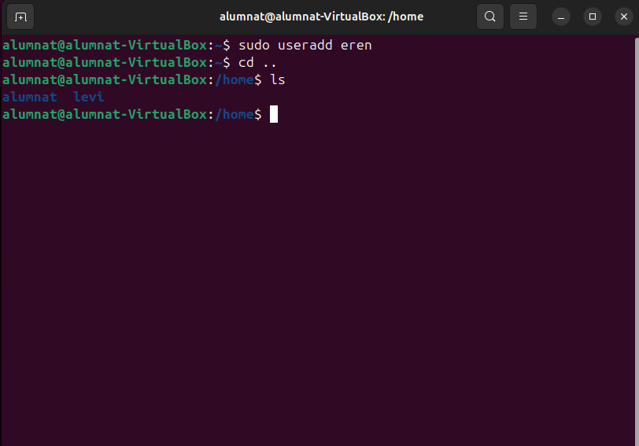{ width=50% }

Com podem veure, no hi ha cap carpeta anomenada "eren" encara que haguéssim creat un usuari amb aqest nom. Igualment, es pot afegir aquesta carpeta amb la següent comanda:

```
sudo mkdir /home/eren
```

La comanda de adalt crearà la carpeta, però no donarà permisos al usuari com a propietari, llavors també hem de fer la següent comanda per a que l'usuari eren sigui el propietari d'aquesta.

```
sudo chown eren:eren /home/eren
```

Aquesta comanda el que fa és canviar el protpietari, tal com significa chown (change owner). La part de eren:eren especifica el usuari i el grup del usuari, com que l'usuari eren no forma part de cap grup, llavors hem de posar el mateix dues vegades


### **Eliminar un usuari**

Per eliminar un usuari però no eliminar els seus fitxers hem d'utilitzar la següent comanda:

```
sudo deluser nom_usuari
```

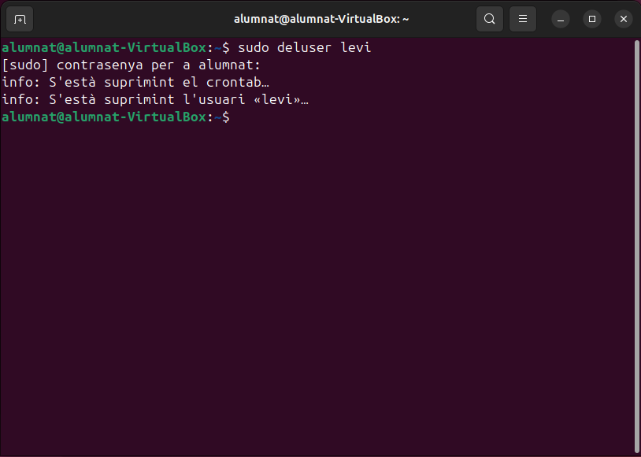{ width=50% }

Si voleu eliminar l'usuari i els seus arxius hem d'utilitzar una comanda diferent:

```
sudo rm -rf /home/nom_usuari
```

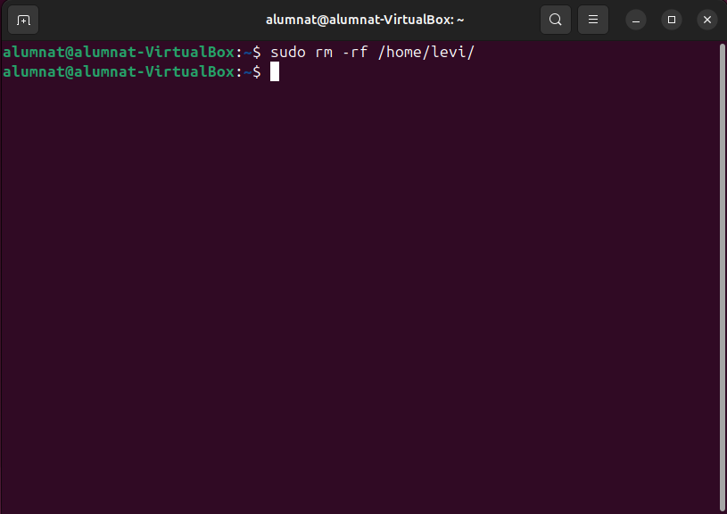{ width=50% }

## **Bloquejar i desbloquejar un usuari**

Per a bloquejar l'accés a un usuari en el dispositiu hem de utilitzar la següent comanda:

```
sudo usermod -L levi
```

De la mateixa manera, per desbloquejar-lo utilitzarem la següent comanda:

```
sudo usermod -U levi
```

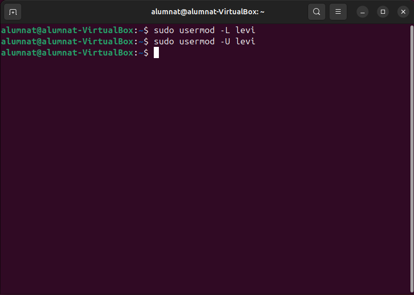{ width=50% }

## **Configuració del directori /etc/skel**

El directori /etc/skel conté els fitxers per defecte que s'afegeixen a cada nou usuari que creem podem examinar aquest directori am b la següent comanda:

```
ls -la /etc/skel
```

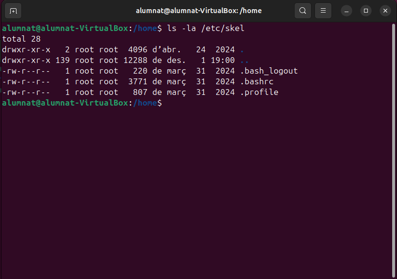{ width=50% }

En la anterior imatge, podem aprecioar 3 arxius diferents:

- **.bash_logout**

    S'executa quan l'usuari tanca la sessió.

    S'utilitza per realitzar tasques finals, com netejar fitxers temporals o registrar l'activitat de l'usuari.

- **.bashrc**

    Fitxer de configuració per al shell Bash.

    Defineix alias, variables d'entorn, funcions personalitzades i comportament general del shell.

- **.profile**

    Executat quan un usuari inicia sessió.

    Configura variables d'entorn generals i comandes inicials.

## **Configuració per defecte dels nous usuaris**

La configuració per defecte d'un usuari en un sistema Linux determina l'entorn inicial i els permisos que té aquest usuari després de ser creat. Aquesta configuració inclou aspectes com el directori personal, els fitxers inicials, l'entorn del shell i els permisos associats.

El fitxer /etc/default/useradd defineix paràmetres predeterminats per a nous usuaris. Algunes configuracions clau són:

- SHELL: Shell predeterminat per als usuaris nous.
- HOME: Prefix del camí al directori personal.
- GROUP: Grup predeterminat.
- SKEL: Camí al directori /etc/skel.

Per a comprovar-ho obrirem l'arxiu amb la següent comanda:

```
sudo nano /etc/default/useradd
```

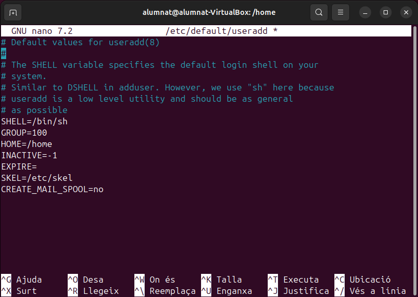{ width=50% }

## **Gestió de grups**

La gestió de grups en Linux és essencial per organitzar els permisos i facilitar l'administració del sistema. Els grups permeten controlar l'accés a fitxers, directoris i recursos compartits per un conjunt d’usuaris.

- **Grup**: Una entitat que agrupa diversos usuaris per assignar permisos comuns.
- **Grup Primari**: Cada usuari té un grup primari associat per defecte. Aquest es defineix en crear l'usuari.
- **Grups Secundaris**: L’usuari pot pertànyer a múltiples grups secundaris per accedir a altres recursos.

### **Crear un grup**

Per crear un grup nou podem outilitzar aquesta comanda:

```
sudo groupadd cos_exploracio
```
I per a comprvar que s'hagi creat el grup, utilitzarem aquesta comanda:

```
cat /etc/group
```
Aquesta comanda ens proporcionara una llista molt gran d'usuaris, però no us preocupeu, només heu d'anar fins avall de tot i trobareu el nou grup

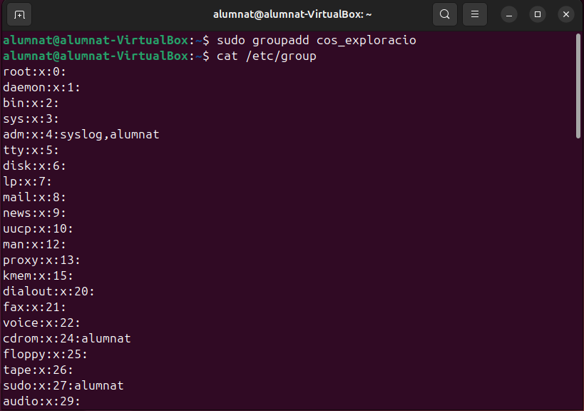{ width=50% }

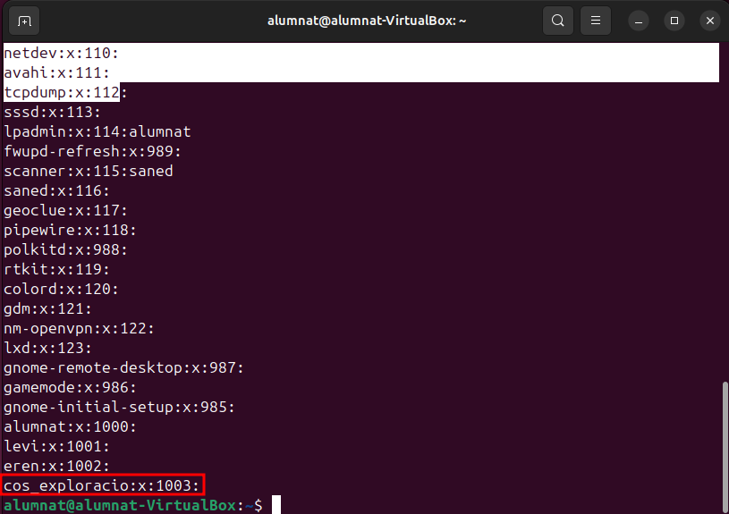{ width=50% }

### **Afegir un usuari a un grup**

Per afegir un usuari dintre d'un grup, el que hem de fer és la següent comanda:

```
sudo gpasswd -a levi cos_exploracio
```

I per a comprovar si hem afegit correctament l'usuari levi dintre del grup de cos_exploracio el que hem de fer és realitzar la següent comanda:

```
grep levi /etc/group
```

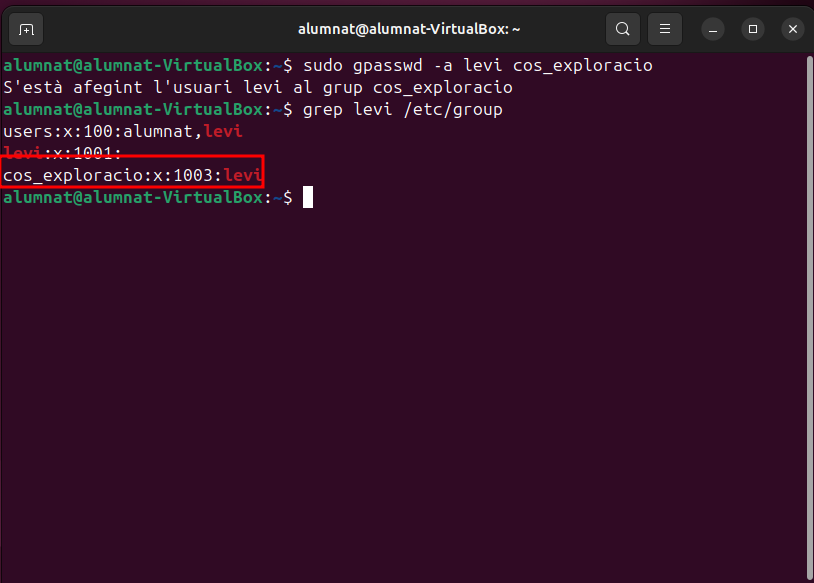{ width=50% }


